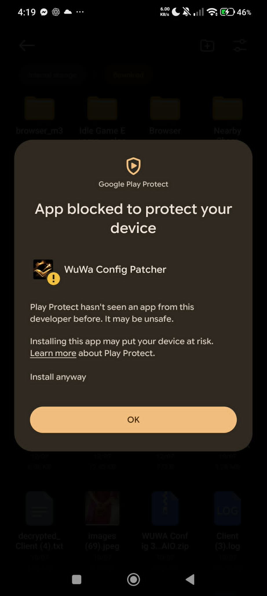
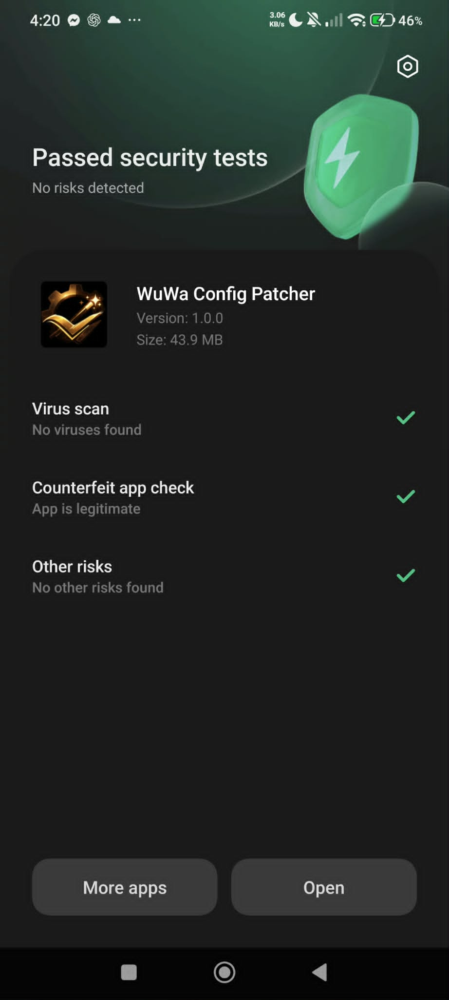
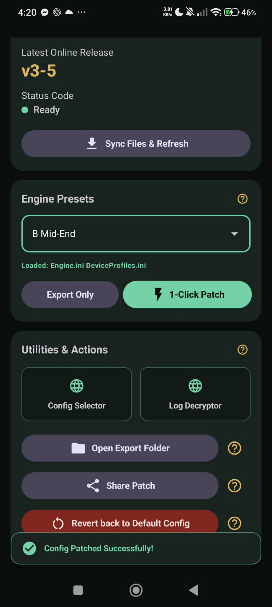

# WuWa Config Patcher

An ultra light-weight (6 MB) android application to improve streamlining of the quality of life in applying mobile configuration for Wuthering Waves.

## 📚 Documentation & Releases

- **Documentation Website:** [https://arglax.github.io/WuWa-Mobile-Config-Patcher/](https://arglax.github.io/WuWa-Mobile-Config-Patcher/)
- **Latest Releases & Downloads:** [https://github.com/Arglax/WuWa-Mobile-Config-Patcher/releases](https://github.com/Arglax/WuWa-Mobile-Config-Patcher/releases)

>[!NOTE]
> **WuWa AI Assistant Enabled:** The official documentation site now features an interactive **AI Assistant** (💬) to help answer your questions, explain CVar settings, troubleshoot Shizuku setups, and guide you directly to the relevant documentation pages!

---

## Key Features

| Feature | Description |
|---|---|
| **1-Click Patching** | Uses Shizuku/AXManager/Root to write game configurations directly to protected game data folders with or without root access. |
| **Safe Revert** | Restore stock game files instantly using standard or advanced revert options to clear modified `.ini` configurations. |
| **Advanced Multi-Select Patching** | Freely select specific combinations of `.ini` files to patch (`Engine.ini`, `DeviceProfiles.ini`, `Scalability.ini`, `GameUserSettings.ini`), or use the quick toggle to apply everything at once. |
| **Flexible Config Sources** | Load configurations from direct download URLs (`.zip`), local directories, custom online repositories, or your active game folder. |
| **Built-in Config Editor** | Edit CVars directly on your device with Smart Mode (steppers and negative values), Raw Mode (search & replace), Isolation Mode, and persistent Undo-Redo history. |
| **Config Analyzer** | Automatically analyze and verify which CVar parameters are applied, overridden, or deleted by the Unreal Engine runtime. |
| **C# Environment Patching** | Force enable the experimental C# scripting runtime for Vulkan optimization. |
| **Automatic Log Extract & Decrypt** | 1-tap extraction of `Client.log` to public storage with automatic decryption into human-readable text for crash diagnosis. |
| **Storage & Diagnostics Toolkit** | Delete oversized or corrupted log files, export and share generated `.zip` patches, and view live device hardware snapshots. |
| **Custom Metadata Reader** | Showcase and read styled author ownership tags, custom notes, and formatted changelogs in custom config packages. |
| **Automatic Update Checker** | Receive startup notifications when newer versions are available with a one-tap link to official GitHub releases. |

## 🛠 Prerequisites
>[!IMPORTANT]
> ### Minimum
> - **Android 11 (API 30)** or higher
> - **Shizuku** installed and running (required for direct game folder access without root)
>  - Via wireless debugging (Android 11+) or a PC/ADB connection at least once for setup
> - **~50 MB free storage** for the app + your exported patch backups
> - **Wuthering Waves (Global)** installed
> - Internet connection (for syncing configs from the repository)
> ## Recommended
> - **Android 13+ (API 33)** or higher — smoother Shizuku wireless debugging pairing, matches modern devices better
> - **Shizuku running persistently** (auto-start on boot via wireless debugging, where supported)
> - **Stable Wi-Fi** for repository sync and patch downloads

This app requires **[Shizuku](https://shizuku.rikka.app/) / [Shizuku_GitHub](https://github.com/RikkaApps/Shizuku/releases/tag/v13.6.0)** to function. Shizuku bypasses Android's scoped storage restrictions and grants the app permission to modify your game files.

1. Install Shizuku from the Google Play Store or the official website.
2. Enable Shizuku via **Wireless Debugging**, **PC-Terminal** (non-rooted devices), or **Root access**.
3. Ensure the Shizuku daemon is active before opening the Patcher.

---

<strong>📖 Usage Guide</strong> (click to expand)

 

<strong>Installation</strong>

Since this app isn't from the Play Store, Android will flag it as unrecognized. This is expected.

1. Tap **Install anyway** when prompted.

   

2. Play Protect will scan and confirm the app is clean and safe to use.

   

3. On first launch, the Setup Wizard will prompt you to grant Shizuku permissions — tap **Allow all the time**.

   

<strong>Applying a Patch</strong>

**If Shizuku is already running:**
1. Open WuWa Config Patcher.
2. Tap **Sync Files & Refresh** (or pull down to refresh) to fetch the latest configs.
3. Select your preferred graphics preset from **Engine Presets**.
4. Tap **1-Click Patch** — you'll get a confirmation once it's applied.

   

**If Shizuku isn't set up yet:**
1. Open the app and trigger the **Setup Wizard** from the main screen.
2. Follow the prompts to install and authorize Shizuku.
3. Once Shizuku shows as **Running** and permission is granted, **1-Click Patch** unlocks automatically.

**To undo a patch:**
Tap **Revert back to Default Config**, confirm the prompt, and you're back to stock settings. The game recreates its default files automatically on next launch.

 

Selecting an Online Repository (Custom URL)

 

Switch the repository source to **Custom Online Repository** and paste in a direct **.zip download link**.

> 💡 To get the link: find the config's download button on its host page, then **right-click (or long-press) → Copy Link Address**. Paste that URL into the app and tap **Sync Files & Refresh**.

Selecting a Local Repository

 

Switch the repository source to **Local Repository** and select a folder containing your `.ini` files.

> ⚠️ Android's scoped storage rules mean you must pick a **specific sub-folder** (e.g. a Downloads folder or a dedicated configs folder) — selecting the root of Internal Storage will be rejected by the system picker.

---

## Disclaimer
>[!IMPORTANT]
>This tool is for optimization purposes only. By using this app, you acknowledge that modifying game files is done at your own discretion. Always ensure you have a backup if you are unsure about the changes you are applying, especially if you have your own **customized** config — otherwise it will be lost. The application does not tamper with your data except to patch the config file, and all included tools run locally on your device. No data is transmitted to an external, online server.
>Also, I am not in any way affiliated with Kuro Games nor Epic Games.  

---

## 💻 Technical Stack

- **Language:** Kotlin
- **UI Framework:** Jetpack Compose (Material 3)
- **Permissions:** Shizuku API
- **Architecture:** Repository-pattern driven, Coroutine-based concurrency
  
---

## Credits
Appreciation Notice to the following individuals for their contributions in creating, testing, bug reporting or suggesting ideas for this project.  
1. nagasemana5608 / Kudoupulse  
2. k4irzw67 / Kyo  
3. oxygen_011  
4. eggsee  
5. ezequieldevteam  
